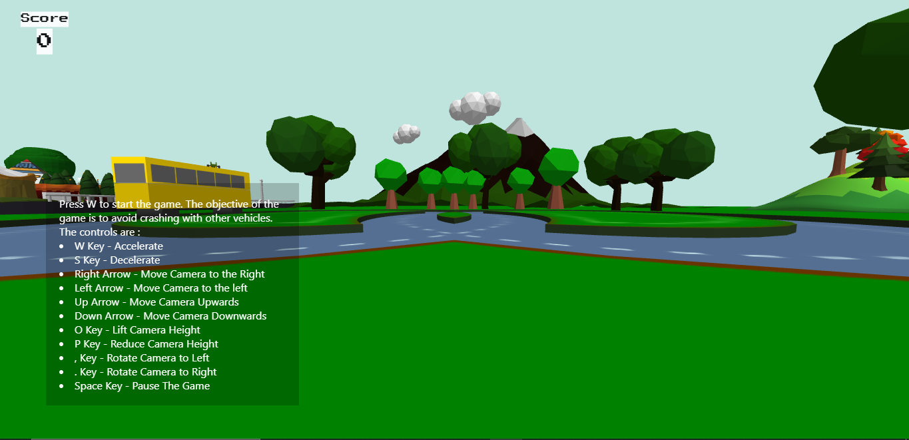
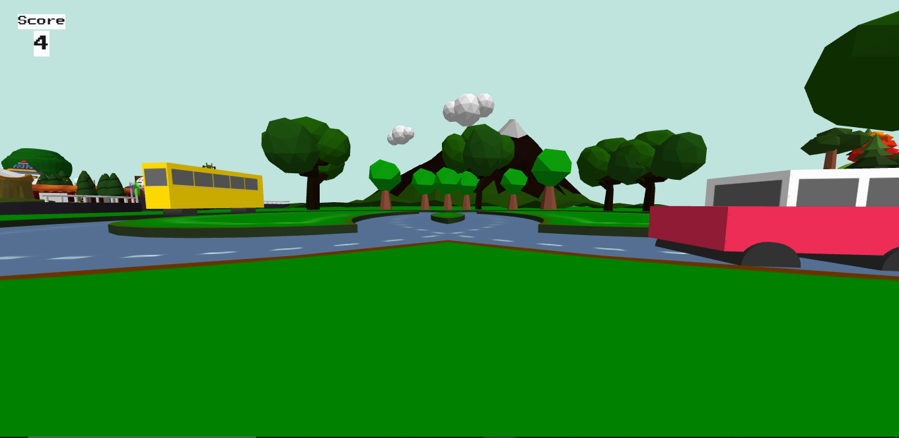
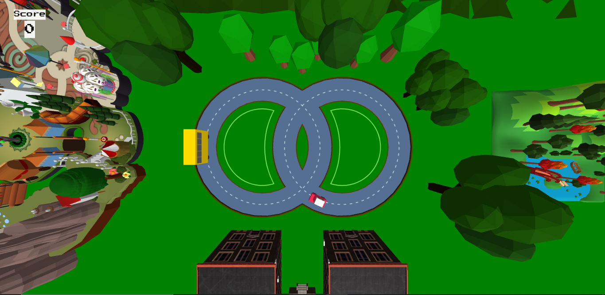
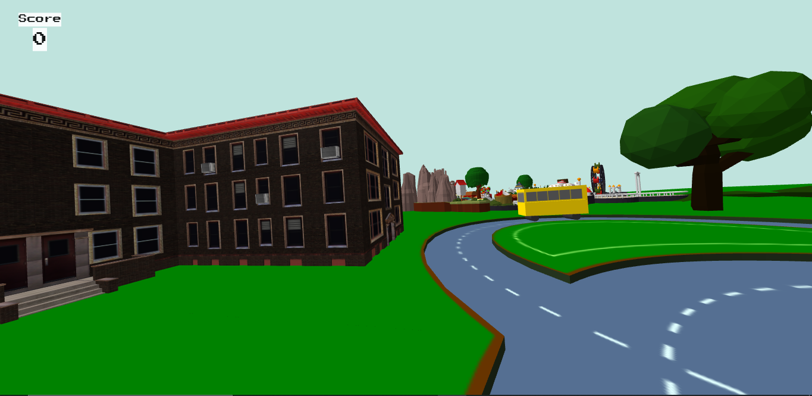
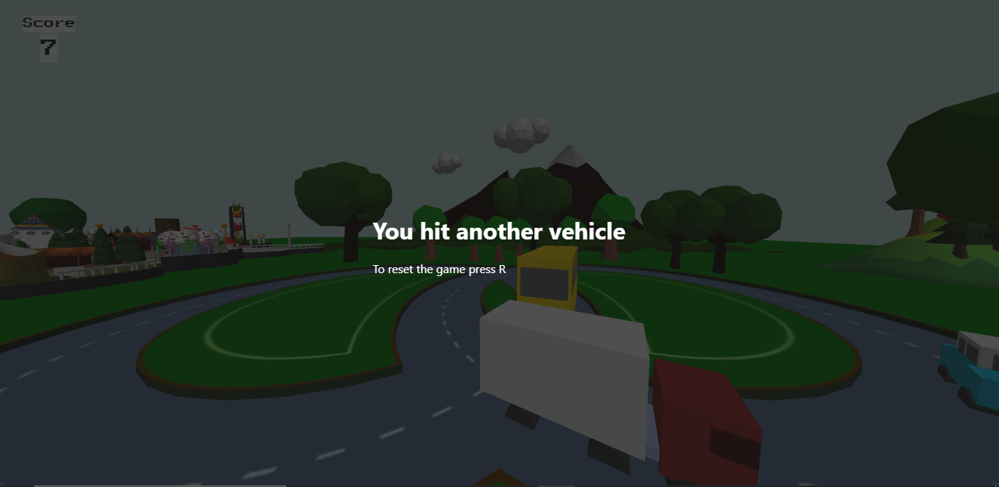

# Final Project : Traffic Madness
## Group 8 : Vincent dan teman teman
Members  | NRP  | 
---------|------
Christian Bennett | 05111940000078
Jason Gunawan | 05111940000085
Frans Wijaya | 05111940000098
Bill Harit | 05111940000114
Adrian | 05111940000130
Vincent Yonathan | 05111940000186

## About Traffic Madness
Saat memainkan Traffic Madness, *objective* utama yang harus dicapai pemain adalah mencetak skor sebanyak-banyaknya. Skor didapatkan setiap kali mobil pemain menempuh satu putaran penuh. Sebagai tantangan, pemain harus menghindari mobil bot yang akan bertambah terus menerus setiap 5 skor yang dicetak oleh pemain. Apabila mobil pemain menabrak mobil bot, maka skor direset dan game berhenti. Adapun game ini dibuat dengan bahasa utama javascript, didukung dengan beberapa elemen html dan css.

## Preview Traffic Madness
- Tampilan game ketika pertama kali dibuka

- Tampilan game ketika pertama kali dimulai

- Tampilan game dilihat dari atas

- Tampilan lingkungan game

- Tampilan ketika game over

## Controls Guide
- Huruf W untuk memulai game (jika game belum dimulai) dan untuk mempercepat laju mobil pemain.
- Huruf S untuk memperlambat laju mobil pemain.
- Huruf O untuk menurunkan ketinggian kamera.
- Huruf P untuk menaikkan ketinggian kamera.
- Karakter , untuk memutar kamera ke kiri
- Karaket . untuk memutar kamera ke kanan
- Karakter panah atas untuk menggeser posisi kamera ke depan
- Karakter panah kiri untuk menggeser posisi kamera ke kiri
- Karakter panah bawah untuk menggeser posisi kamera ke balakang
- Karakter panah kanan untuk menggeser posisi kamera ke kanan
---
> Game dapat dilihat pada link berikut :
[Traffic Madness](https://vincentyonathan.itch.io/traffic-madness)
